# zookeeper

#### 1.zookeeper概述

##### 1.1概述:提供协调服务,服务应用程序,生活版:美团,58等

##### 1.2 工作机制

- zookeeper是一个基于观察者模式设计的分布式服务管理框架

- 它负责存储和管理大家都关心的数据
  - 然后接受观察者的注册,一旦这些数据发生变化
  - Zookeeper就将负责通知已经注册的那些观察者做出相应的反应
  - 从而实现集群中类似Master/Slave管理模式
  
- Zookeeper = 文件系统 + 通知机制

  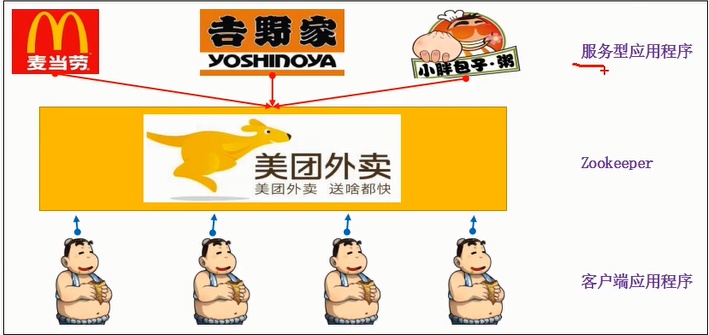


##### 1.3数据结构

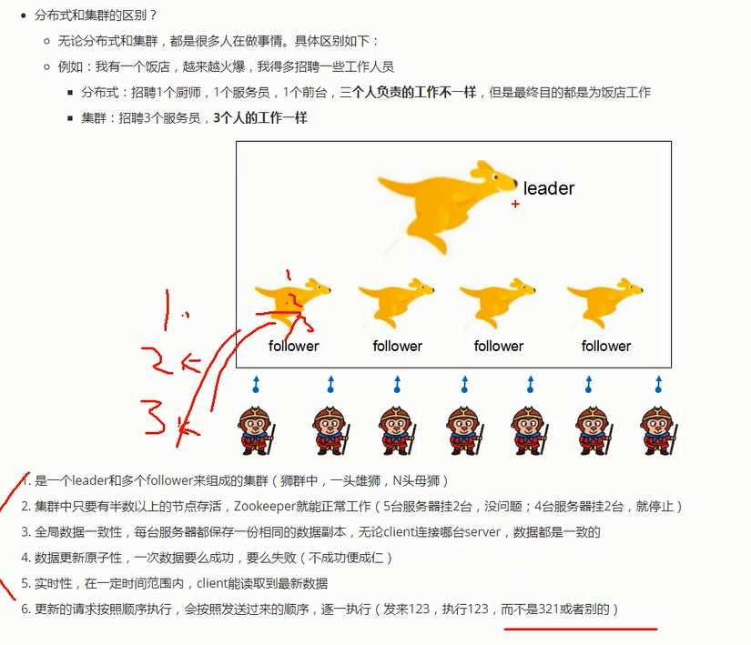

##### 1.4数据结构

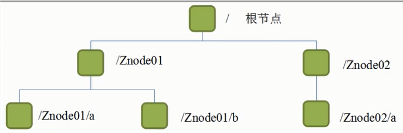

- 和linux很像,每个节点称作一个ZNode
- 每个ZNode默认能够存储1MB的数据(元数据),每个ZNode路径都是唯一的
  - 元数据,又称中介数据丶中继数据,为描述数据的数据,主要是描述数据库属性的信息,用来支持如指示存储位置,历史数据,资源查找,文件记录等功能

##### 1.5 应用场景

###### 1.5.1 统一命名服务

###### 1.5.2 统一配置管理

1.5.3 服务器节点动态上下线

1.5.4 软负载均衡

雨露均沾

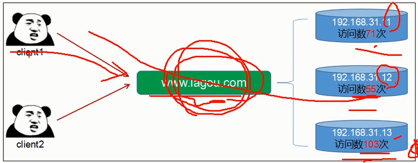

#### 2.Zookeeper本地模式安装

##### 2.1本地模式安装

###### 2.1.1 安装前准备

1. 安装jdk

2. 拷贝apache_zookeeper.bin.gz到xztemp目录下

3. 解压安装包

   ```
   tar -zxvf apache-zookeeper
   ```

4. 重命名

   ```
   mv apache-zookeeper-3.6.0-bin zookeeper
   ```

###### 2.1.2 配置修改

1.在/xztemp/zookeeper/这个目录上创建zkData和zkLog目录

```
mkdir zkDate
mkdir zkLog
```

2.进入/opt/zookeeper/conf这个路径,复制一份zoo_sample.cfg

```
cp zoo_sample.cfg zoo.cfg
```

3.编辑zoo.cfg文件,修改dataDir路径

```
dataDir=/xztemp/zookeeper/zkData
dataLogDir=/xztemp/zookeeper/zkLog
```

###### 2.1.3 操作zookeeper

1.启动zookeeper

```
./zkServer.sh start
```

2.查看进程是否启动

```
jps
```

QuorumPeerMain:是zookeeper集群的启动入口类,是用来加载配置启动QuorumPeer线程的

3.查看状态:

```
./zkServer.sh status
```

4.启动客户端

```makefile
./zkCli.sh
```

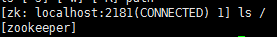默认只有这一个节点

5.退出客户端

```
quit
```

6.停止Zookeeper

```
./zkServer.sh stop
```

##### 2.2配置参数解读

Zookeeper中的配置文件zoo.cfg中参数含义解读如下:

- tickTime=2000:通信心跳数,Zookeeper服务器与客户端心跳时间,单位毫秒
  - Zookeeper使用的基本时间,服务器之间或客户端与服务器之间维持心跳的时间间隔,也就是每个tickTime时间就会发送一个心跳,时间单位为毫秒.

- initLimit =10: LF初始通信时限
  - 集群中的Follower跟随着服务器与Leader领导者服务器之间,启动时能容忍的最多心跳数
  - 10*2000(10个心跳时间)如果领导和跟随者没有发出心跳通信,就视为失效链接,领导和跟随者断开

- syncLimit=5: LF同步通信时限
  - 集群启动后,Leader和Follower之间的最大响应时间单位,加入响应超过了syncLimit*tickTime->10秒Leader就认为Follower已经死掉,会将Followe从服务器列表中删除

- dataLogDir:日志文件目录
- clientPort=2181:客户端连接端口
  - 监听客户端连接的端口

#### 3.Zookeeper内部原理

##### 3.1 选举机制(面试重点)

- 半数以上机制,最好是奇数
- Leader是通过选举临时产生的

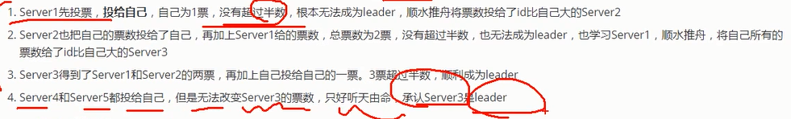

##### 3.2节点类型

- 持久型:
  - 持久目录节点(persistent)客户端与zookeeper断开连接后,该节点依旧存在
  - 持久化顺序编号目录节点(persistent_sequential)客户端与zookeeper断开连接后,该节点依旧存在,创建znode时设置顺序标识,znode名称后会附加一个值,顺序号是一个单调递增的计数器,由父节点维护,例如:Znode001,Znode002
- 短暂型
  - 临时目录节点(ephemeral)客户端和服务器端断开连接后,创建的节点自动删除
  - 临时顺序编号目录节点(ephemeral_sequential)客户端与zookeeper断开连接后,该节点被删除,创建znode时设置顺序标识,znode名称后会附加一个值,顺序号是一个单调递增的计数器,由父节点维护,如Znode001,Znode002

序号是相当于i++

##### 3.3 监听器原理(面试重点)

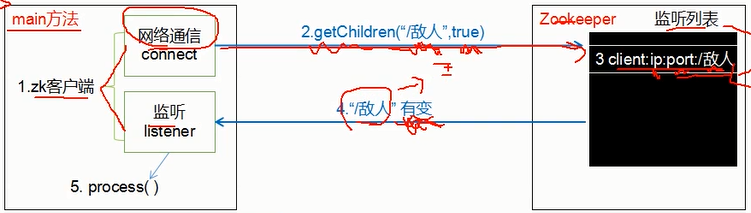

1.在main方法中创建Zookeeper客户端的同时会创建两个线程,一个负责网络连接通信,一个负责监听

2.监听事件就会通过网络通信发送给zookeeper

3.zookepper获得注册的监听事件后,立刻将监听事件添加到监听列表里

4.zookeeper监听到 数据变化或路径变化,就会将这个消息发送给监听线程

​	常见的监听

​	1.监听节点数据的变化:get path[watch]

​	2.监听子节点增减的变化: Is path[watch]

5.监听线程就会在内部调用process方法()

##### 3.4写数据流程

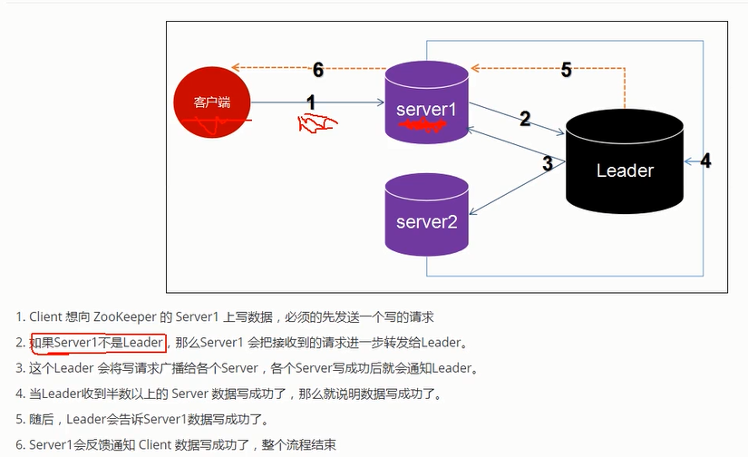

#### 4.Zookeeper实战(开发重点)

##### 4.1 分布式安装部署

集群思路:先搞定一台服务器,再克隆出两台,形成集群!

###### 4.1.1 安装zookeeper

请参考文本2.1

###### 4.1.2 配置服务器编号

在/xztemp/zookeeper/zkData创建myid文件

```
vim myid
```

在文件中添加与server对应的编号: 1

其余两台服务器分别对应2和3

###### 4.1.3 配置zoo.cfg文件

打开zoo.cfg文件,增加如下配置

```makefile
##############luster#############
server.1=192.168.249.81:2888:3888
server.2=192.168.249.82:2888:3888
server.3=192.168.249.83:2888:3888
```

配置参数解读 server.A=B:C:D

A:一个数字,表示第几号服务器
	集群模式下配置的/xztemp/zookeeper/zkData/myId文件里面的数据就是

B:服务器的ip地址

C:与集群中Leader服务器交换信息的端口

D:选举时专用端口,万一集群中的Leader服务器挂了,需要一个端口来重新进行选举,选出一个新的Leader,而这个端口就是用来执行选举时服务器相互通信的端口

###### 4.1.4 配置其余两台服务器

1.在虚拟机数据目录vms下,创建zk02

2.将本台服务器数据目录下的.vmx文件和所有的.vmdk文件分别拷贝zk02下

3.虚拟机->文件->打开(选择zk02下的.vmx文件)

4.开启此虚拟机,弹出对话框,选择"我已复制该虚拟机"

5.进入系统后,修改linux中的ip,修改/xztemp/zookeeper/zkData/myId中的数值为2,第三台服务器zk03,重复上面的步骤

###### 4.1.5  集群操作

1.每台服务器的防火墙必须关闭

```makefile
systemctl stop firewalld.service
```

2.启动第一台

```makefile
./zkServer.sh start
```

3.查看状态

```
./zkServer.sh status
```

4.当启动第2台服务器时

​	查看第1台的状态: Mode:follower

​	查看第2台的状态:Mode: leader

##### 4.2 客户端命令行操作

- 启动客户端

```
./zkCli.sh
```

- 显示所有的操作命令

```
help
```

- 查看当前znode中所包含的内容

  zookeeper老版本使用ls2 /,现在已被新命令替代

  ```
  ls -s
  ```

  - cZxid:创建节点的事务

    - 每次修改Zookeeper状态都会收到一个zxid形式的时间戳,也就是Zookeeper事务ID.
    - 事务ID是Zookeeper中所有修改总的次序
    - 每个修改都有唯一的zxid,如果zxid1小于zxid2,那么zxid1在zxid2之前发生.

  - ctime: 被创建的毫秒数(从1970年开始)

  - mZxid:最后更新的事务zxid

  - mtime:最后修改的毫秒数(从1970年开始)

  - pZxid:最后更新的子节点事务zxid

  - cversion:创建版本号,子节点修改次数

  - dataVersion: 数据变化版本号

  - aclVersion:权限版本号

  - ephemeralOwner:如果是临时节点,这个是znode拥有者的session id

  - dataLength: 数据长度

  - numChildren:子节点数

    

- 分别创建2个普通节点

  - 在根目录下,创建中国和美国两个节点

  ```
  create /china
  create /usa
  ```

  - 在根目录下,创建俄罗斯节点,并保存"pj"数据到节点上

  ```
  create /ru "pj"
  ```

  - 多级创建节点
    - 在日本下,创建东京  "热"
    - japan必须提前创建好,否则报错"节点不存在"

  ```
  create /japan/Tokyo "hot"
  ```

- 获得节点的值

  ```
  get /japan/Tokeyo
  ```

  

- 创建短暂节点:创建成功之后,quit退出客户端,重新连接,短暂的节点消失

  ```makefile
  #e是临时节点
  create -e /uk
  ls /
  quit
  ls /
  ```

  

- 创建带序号的节点

  - 在俄罗斯ru下,创建3个city

    ```makefile
    create -s /ru/city #执行三次
    ls /ru
    [city0000000000,city0000000001,city0000000002]
    ```

  - 如果原来没有序号节点,序号从0开始递增.

  - 如果原节点下已有2个节点,则再排序时从2开始,以此类推

- 修改节点数据值

  ```
  set /usa "telanpu"
  ```

  

- 监听 节点的值变化 或 子节点变化(路径变化)

  1.在server3主机上注册监听/usa节点的数据变化

  ```
  addWatch /usa
  ```

  2.在Server1主机上修改/usa的数据

  ```
  set /usa "telanpu"
  ```

  3.server3会理科响应

  ​	WatchedEvent state:SyncConnected type : NodeDataChanged path :/usa

  4.如果再Server1的/usa下面创建子节点NewYork

  ```
  create /usa/NewYork
  ```

  5.Server3会立刻相应

   WatchedEvent state:SyncConnected type:NodeCreatedpath:/usa/NewYork

- 删除节点

  ```
  delete /china
  delete /china/fj
  ```

  

##### 4.3.3 创建节点

- 一个ACL对象就是一个Id和permission对
  - 表示哪个/哪些范围的id(who)在通过了怎样的鉴权(how)之后,就允许进行那些操作(what): WHo How What;
  - permission(What)就是一个int表示的位码,每一位代表一个对应操作的允许状态
  - 类似linux的文件权限,不同的是共有5中操作:CREATE,READ,WRITE,DELETE,ADMIN(对应更改ACL的权限)
    - OPEN_ACL_UNSAGE: 创建开放节点,允许任意操作(用的最少,其余的权限用的很少)
    - READ_ACL_UNSAVE: 创建只读节点
    - CREATOR_ALL_ACL: 创建者才有全部权限

```java
@Before
    public void init() throws IOException {
        //省略...
    }

    @Test
    public void createNode() {
        String nodeCreate=zkClient.create("/lg1","laox".getBytes(),ZooDefs.Ids.OPEN_ACL_UNSAFE, CreateMode.PERSISTENT);
        //参数1:要创建的节点路径
        //参数2:节点数据
        //参数3:节点权限
        //参数4:节点的类型
        System.out.println("已创建节点  : "+ nodeCreate);
    }
```

##### 4.3.4查询节点的值

```java
//获取节点上的值
    @Test
    public void getNode() throws KeeperException, InterruptedException {
        byte[] getNode = zkClient.getData("/lg1",false,new Stat());
        String str = new String(getNode);
        System.out.println("lg1的节点数据是: " + str);
    }
```


##### 4.3.5 修改节点的值

```java
//修改节点上的数据
    @Test
    public void updataData() throws KeeperException, InterruptedException {
        zkClient.setData("/lg1","新值".getBytes(),0);
    }
```

##### 4.3.6删除节点的值

```java
//删除节点
    @Test
    public void deleteData() throws KeeperException, InterruptedException {
        zkClient.delete("/lg",1);
    }
```

##### 4.3.7获取子节点

```java
//获取子节点
    @Test
    public void getChild() throws KeeperException, InterruptedException {
        List<String> children = zkClient.getChildren("/china", false);
        for (String child : children) {
            System.out.println(child);
        }
    }
```

##### 4.3.8监听子节点的变化

```java
//监听根节点下面的变化
//在@befor里已经声明了监听器
    @Test
    public void watchNode() throws KeeperException, InterruptedException, IOException {
        List<String> children = zkClient.getChildren("/", true);
        for (String child : children) {
            System.out.println(child);
            System.in.read();
        }
    }
```

##### 4.3.9 美团商家用户示例

###### 创建链接

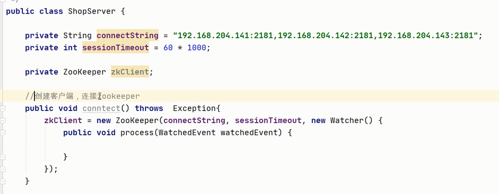

###### 商家向美团注册

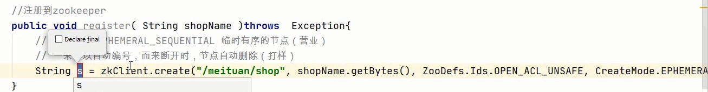


###### 商家操作流程

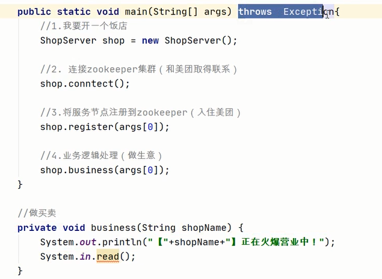


###### 用户操作流程

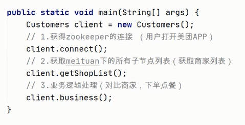


###### 目前正在营业的商家

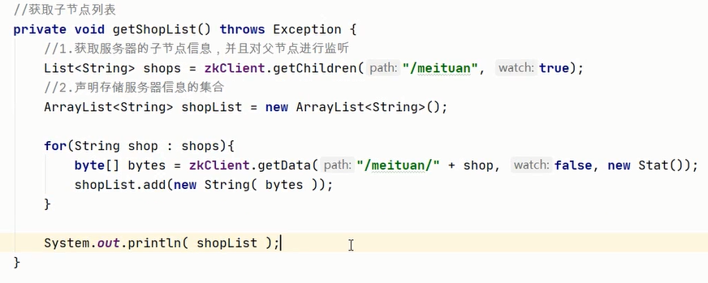

###### 用户正在浏览商家

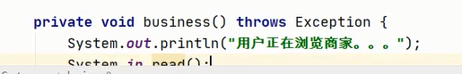

#### 4.5 案例-分布式锁-商品秒杀

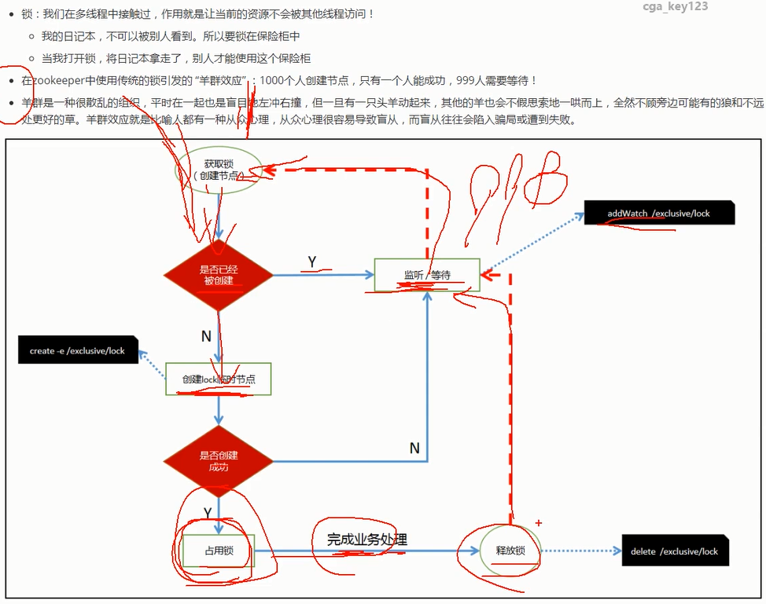

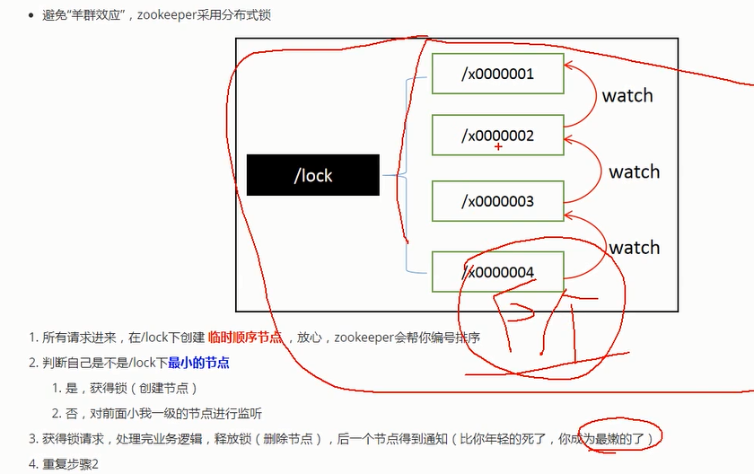

#####  实现步骤

###### 1.初始化数据库

创建数据库zkproduct,使用默认字段utf8

```mysql
-- 商品类
create table product (
	id int primary key auto_increment comment '商品编号',
	product_name varchar(20) not null comment '商品名称',
	stock int not null comment '库存',
  version int not null comment '版本'
)


create table `order` (
	id varchar(100) primary key , 
	pid int not null,            
	userid int not null
)
```

