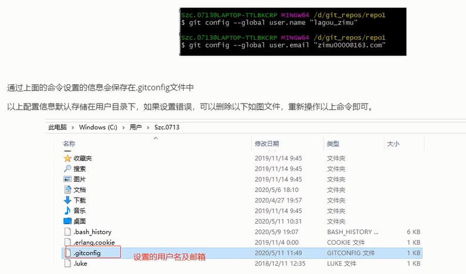
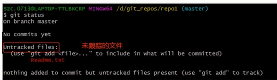
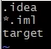
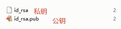
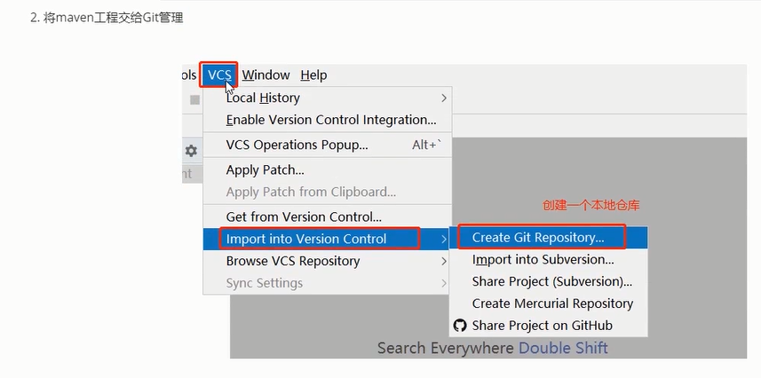
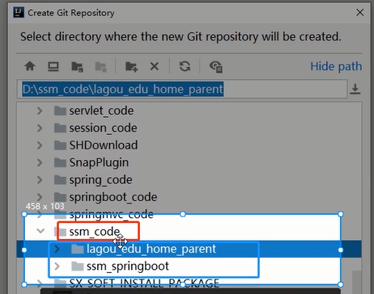
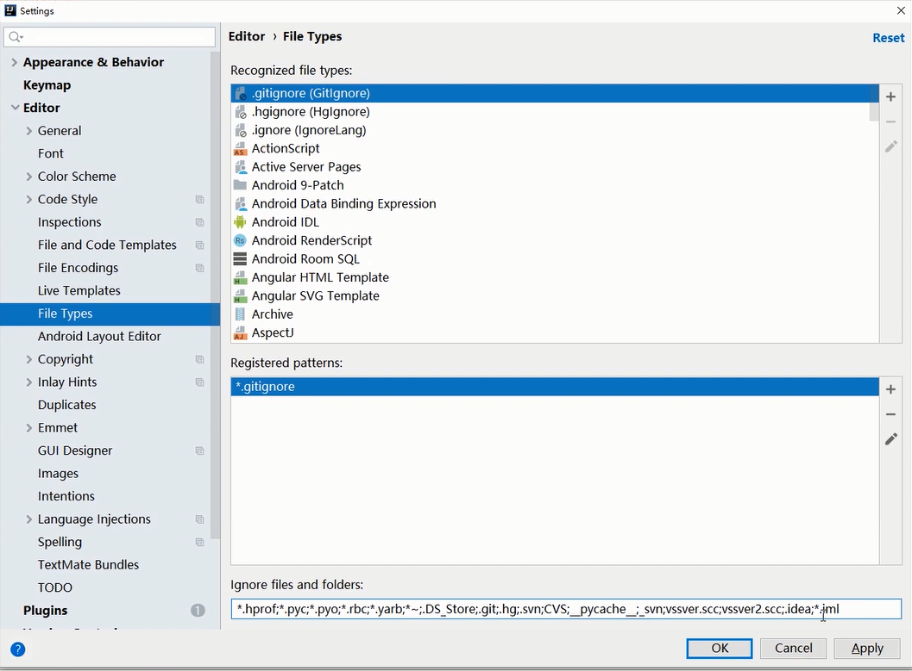
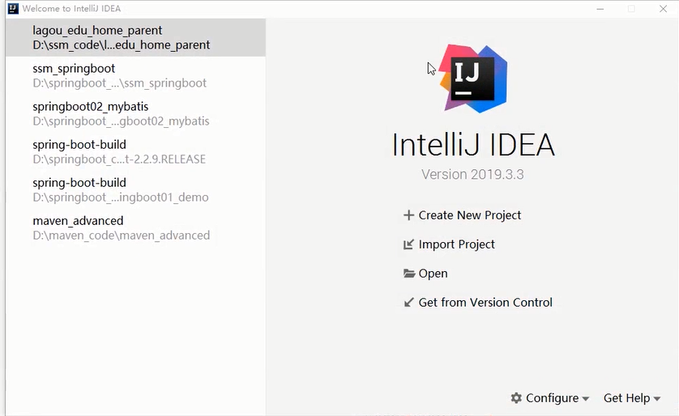

## Git

### 三.  git的基本配置

#### 3.1 基本配置

1.安装完成Git后,正式使用git前,是需要进行一些全局设置的,如用户名,邮箱.

设置的主要命令是git config:

```makefile
#设置全局用户名
git config --global user.name "your name"
#设置邮箱
git config --global user.email "your email"
```

其中,--global指定为全局配置,不使用该参数,则为当前所在仓库配置.




2.查看配置信息

```makefile
#查看配置信息
git config --list
```

#### 3.2 构建本地参考

```makefile
git init
```

#### 3.3 本地仓库的操作

##### 3.3.2当前文件的状态

```makefile
#命令形式:git status [-s]
```



##### 3.3.3 将文件添加到本地版本库

```makefile
git add 文件名
git commit -m "提交信息"
```

##### 3.3.4 查看提交的历史

```makefile
git log
git log --pretty=oneline
```

##### 3.3.5 版本回退

有了git log来查看提交的历史记录,我们就可以通过git reset --hard来回退我们需要的特定版本,然后使用当时的代码进行各种操作

```makefile
#回退到 commit_id 指定的提交版本
git reset --har 'commit_id'
```

回到未来的某个提交

```makefile
git reflog
git reset --hard 'commit_id'
```

##### 3.3.6 删除文件

在文件添加到暂存区之前,对想删除的文件可以直接物理删除.如果文件已被提交,则需要git rm 来删除

```makefile
git rm readme.md
```

git rm只能删除已提交到版本库的文件

##### 3.3.7 如何添加文件到忽略列表

在工作目录下创建一个.gitignore文件

在文件里编辑

###  四. 分支管理

##### 查看分支

```makefile
#查看本地分支信息
git branch
# 查看相对详细的本地分支信息
git branch -v
# 查看包括远程仓库在内的分支信息
git branch -av
```

##### 创建分支

```makefile
# 新建一个名称为dev的分支
git branch dev
```

##### 切换分支

```makefile
# 新建玩dev分支后,通过该命令切换到dev分支
git checkout dev
```

##### 创建并切换分支

```makefile
 #新建dev分支,并切换到该分支上
 git checkout -b dev
```

##### 合并分支

```makefile
# 切换回master分支
git checkout master
# 将dev分支中的修改合并回master分支
git merge dev
```

合并回主分支的时候,可能会面临到冲突的问题

需:git add ./ 然后再commit

##### 删除分支

当之前创建的分支,完成了它的使命,如bug修复完,分支合并以后,这个分支就不需要了,

```makefile
# 删除dev分支
git branch -d dev
```

### 五. git远程仓库

##### 生成公钥和私钥

ssh-keygen -t rsa

执行命令完成后,在window本地用户.ssh目录:c:\Users\用户名.ssh下面生成如下名称的公钥和私钥



### 六,远程仓库的操作

##### 6.1查看远程仓库

```makefile
#命令形式: git remote -v
#origin --仓库服务器的默认名称
```

##### 6.2 添加远程仓库

如果已经有了一个本地仓库,然后打算将它发布到远程,与其他人协作,那么使用:

```makefile
# 为本地仓库添加远程仓库
git remote add origin your_remote_git_repo
```

##### 6.3推送本地仓库的内容到远程仓库

```makefile
# 第一次推送时使用,可以简化后面的推送或者拉取命令使用
git push -u origin master
# 将本地master 分支推送到origin远程分支
git push origin master
```

##### 6.4从远程仓库获取最新内容

在多人协作过程中,当自己完成了本地仓库中的提交,想要向远程仓库推送前,需要先获取到远程仓库的最新内容

```makefile
git fetch origin master
git pull origin master
```

git fetch 是仅仅获取远程仓库额更新内容,并不会自动做合并

git pull 做自动合并,可看做是git fetch后再git merge

##### 6.5移除无效的远程仓库

如果因为一些原因想要移除一个远程仓库

git remote rm <shortname>

### 七. IDE下Git的使用

##### 7.1 git的配置


##### 7.2 初始化并提交项目到远程仓库

先创建一个本地仓库





##### 7.3 配置gitignore文件



##### 7.4 克隆远程仓库到本地




```java
@ApiModelProperty(value = "打印机密码")protected String printerp;@ApiModelProperty(value = "打印机账号")protected String printeru;@ApiModelProperty(value = "打印机密码")protected String printerp2;@ApiModelProperty(value = "打印机账号")protected String printeru2;@ApiModelProperty(value = "打印机密码")protected String printerp3;@ApiModelProperty(value = "打印机账号")protected String printeru3;@ApiModelProperty(value = "打印数量")protected Integer printNumber;@ApiModelProperty(value = "打印数量")protected Integer printNumber2;@ApiModelProperty(value = "打印数量")protected Integer printNumber3;
```


```

```

