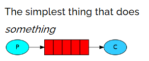

# rabbitMQ

## 1.什么是RabbitMQ

### 1.1MQ消息队列

- 消息队列中间件,是分布式系统中的重要组件
- 主要解决,异步处理,应用解耦,流量削峰等问题
- 从而实现高性能,高可用,可伸缩和最终一致性的架构
- 使用较多的消息队列产品:RabbitMQ,RocketMQ,ActiveMQ,ZeroMQ,Kafka


#### 1.1.1 异步处理

- 用户注册,发送验证邮箱和手机验证码;
- 将注册的信息写入数据库,发送验证邮件,发送手机,三个步骤全部完成后,返回给客户端


### 1.2 背景知识介绍


### 1.3 为什么选择RabbitMQ

### 1.4RabbitMQ个组件功能


## 2. 怎么使用RabbitMQ

### centos7安装RabbitMQ

#### 1.安装erlang

```
安装依赖gcc
yum -y install gcc glibc-devel make ncurses-devel openssl-devel xmlto perl wget gtk2-devel binutils-devel

下载erlang
wget http://erlang.org/download/otp_src_22.0.tar.gz

解压
tar -zxvf otp_src_22.0.tar.gz

配置安装路径
./configure --prefix=/xz/erlang/installDir

安装
make install

安装完成installDir下会有bin文件

添加环境变量,刷新环境变量
echo 'export PATH=$PATH:/xz/erlang/installDir/bin' >> /etc/profile

刷新环境变量
source /etc/profile

看是否安装er成功
erl
halt().退出来
```


#### 2.接下来,安装RabbitMQ

```
下载
wget https://github.com/rabbitmq/rabbitmq-server/releases/download/v3.7.15/rabbitmq-server-generic-unix-3.7.15.tar.xz

由于是tar.xz格式的所以需要用到xz，没有的话就先安装 
yum install -y xz

第一次解压
/bin/xz -d rabbitmq-server-generic-unix-3.7.15.tar.xz

第二次解压
tar -xvf rabbitmq-server-generic-unix-3.7.15.tar

配置环境变量
echo 'export PATH=$PATH:/xz/rabbitmq/rabbitmq_server-3.7.15/sbin' >> /etc/profile

刷新变量
source /etc/profile

如果需要可以创建配置目录
mkdir /etc/rabbitmq
```


#### 4.启动命令

```
启动:
rabbitmq-server -detached

停止
rabbitmqctl stop

状态
rabbitmqctl status

开启web插件
rabbitmq-plugins enable rabbitmq_management
```


#### 5.用户管理

```
查看所有用户
rabbitmqctl list_users

添加一个用户
rabbitmqctl add_user xz 123456

配置权限
rabbitmqctl set_permissions -p "/" xz ".*" ".*" ".*"

查看用户权限
rabbitmqctl list_user_permissions xz

设置tag
rabbitmqctl set_user_tags xz administrator

删除用户(安全起见,删除默认用户)
rabbitmqctl delete_user guest
```


#### 6.界面管理介绍


## 3.java链接RabbitMQ

## 4.RabbitMQ的模式

5种模式,需要翻墙

https://www.rabbitmq.com/getstarted.html




 


### 1.简单模式

#### 链接工厂

```
 public  static Connection getConnection() throws Exception {
        //1.创建连接工厂
        ConnectionFactory factory = new ConnectionFactory();
        //2.在工厂对象中设置mq的链接信息(ip,port,vhost,username,password)
        factory.setHost("121.5.195.25");
        factory.setPort(5672);
        factory.setVirtualHost("/");
        factory.setUsername("xz");
        factory.setPassword("123456");

        //通过工厂获得与MQ的链接
        Connection connection = factory.newConnection();
        return connection;

    }

    public static void main(String[] args) throws Exception {
        Connection connection = getConnection();
        System.out.println(connection);
        connection.close();
    }
```

#### 生产者

```java
 //获得链接
        Connection connection = ConnectionUtil.getConnection();
        //创建信道
        Channel channel = connection.createChannel();
        //创建消息队列(1,2,3,4,5)
        /*
        参数1:队列的名称
        参数2:队列中的数据是否持久化
        参数3:是否排外(是否支持拓展,当前队列只能给自己用,不能给别人用)
        参数4:是否自动删除(当队列的链接数为0时,队列会销毁,不管队列中是否还保存数据)
        参数5:队列参数(没有参数为null)
         */
        channel.queueDeclareNoWait("queue2",false,false,false,null);

        //向队列发送消息
        /*
        参数1:交换机名称,当前是简单模式,也就是p2p模式,没有交换机,所以名称为""
        参数2:目标队列的名称
        参数3:设置消息的属性
        参数4:消息的内容(只接收字节数组)

         */
        String msg = "正在使用mq";
        channel.basicPublish("","queue1",null,msg.getBytes());
        System.out.println("发送MQ:" +msg);

        //释放资源
        channel.close();
        connection.close();
```


#### 消费者

```java
//1.获得链接
        Connection connection = ConnectionUtil.getConnection();
        //2.获得信道
        Channel channel = connection.createChannel();
        //3.从信道中获得消息
        DefaultConsumer consumer = new DefaultConsumer(channel){
            @Override
            public void handleDelivery(String consumerTag, Envelope envelope, AMQP.BasicProperties properties, byte[] body) throws IOException {
                //super.handleDelivery(consumerTag, envelope, properties, body);
                String s = new String (body);
                System.out.println("接收 = " + s);
            }
        };
        //4.监听队列 true:自动消息确认
        channel.basicConsume("queue1",true,consumer);
```


#### 消息确认机制ACK

自动

手动


```
//4.监听队列 true:自动消息确认
channel.basicConsume("queue2",false,consumer);
```


### 2.工作队列模式

```
//设置一次只接收一条
channel.basicQos(1);
```


### 3.发布订阅模式


#### 1.fanout模式

生产者

```
Connection connection = ConnectionUtil.getConnection();
        Channel channel = connection.createChannel();
        //声明路由(路由名,路由类型)
        // fanout: 不处理路由键(只需要将队列绑定到路由上,发送到路由的消息都会被转发到与该路由绑定的所有队列)
        channel.exchangeDeclare("test_exchange_fanout","fanout");
        String msg = "消息订阅模式生产者!";

        channel.basicPublish("test_exchange_fanout","",null,msg.getBytes());
        System.out.println("生产:" +msg);
```

消费者

```
//1.获得链接
        Connection connection = ConnectionUtil.getConnection();
        //2.获得信道
        Channel channel = connection.createChannel();
        //声明队列
        channel.queueDeclare("test_exchange_fanout_queue_1",false,false,false,null);
        //绑定路由
        channel.queueBind("test_exchange_fanout_queue_1","test_exchange_fanout","");
        //3.从信道中获得消息
        DefaultConsumer consumer = new DefaultConsumer(channel){
            @Override
            public void handleDelivery(String consumerTag, Envelope envelope, AMQP.BasicProperties properties, byte[] body) throws IOException {
                //super.handleDelivery(consumerTag, envelope, properties, body);
                String s = new String (body);
                System.out.println("消费者1 = " + s);
                //手动确认(收件人信息,是否同时确认多个消息)
                channel.basicAck(envelope.getDeliveryTag(),false);

            }
        };
        //4.监听队列 true:自动消息确认
        channel.basicConsume("test_exchange_fanout_queue_1",false,consumer);
```


#### 2.路由模式


### 5.spring整合RabbitMQ

创建队列和绑定

```java
public void afterPropertiesSet() throws Exception {
        ApplicationContext applicationContext = SpringUtils.getApplicationContext();
        DefaultListableBeanFactory fty = (DefaultListableBeanFactory) applicationContext.getAutowireCapableBeanFactory();

        //创建交换机
        String exchangeName = "directExchange";
        if (exchangeName.equals("directExchange")){
            fty.registerBeanDefinition(exchangeName, BeanDefinitionBuilder.genericBeanDefinition(DirectExchange.class, () -> (DirectExchange) ExchangeBuilder
                    .directExchange(exchangeName)
                    .durable(true)
                    .build()).getBeanDefinition());
        }else if (exchangeName.equals("topicExchange")){
            fty.registerBeanDefinition(exchangeName, BeanDefinitionBuilder.genericBeanDefinition(TopicExchange.class, () -> (TopicExchange) ExchangeBuilder
                    .topicExchange(exchangeName)
                    .durable(true)
                    .build()).getBeanDefinition());
        }else {
            fty.registerBeanDefinition(exchangeName, BeanDefinitionBuilder.genericBeanDefinition(FanoutExchange.class, () -> (FanoutExchange) ExchangeBuilder
                    .fanoutExchange(exchangeName)
                    .durable(true)
                    .build()).getBeanDefinition());
        }
        System.out.println("交换机创建成功");


        //队列名称
        String queueName = "TestDirectQueue";
        //交换机名称
        //String exchangeName = "TestDirectExchange";
        //声明一个队列实例
        Queue queue = new Queue(queueName, true);

        BeanDefinitionBuilder queueBuilder = BeanDefinitionBuilder.genericBeanDefinition(Queue.class);
        queueBuilder.addConstructorArgValue(queue.getName());
        queueBuilder.addConstructorArgValue(true);
        queueBuilder.setAutowireMode(AUTOWIRE_BY_NAME);
        fty.registerBeanDefinition(queue.getName(), queueBuilder.getBeanDefinition());
        System.out.println("[---正在创建第1个队列---]:" + queueName);
        //路由key
        String routingKey = "TestDirectRouting";
        BeanDefinitionBuilder bindBuilder = BeanDefinitionBuilder.genericBeanDefinition(Binding.class);
        bindBuilder.addConstructorArgValue(queueName);
        bindBuilder.addConstructorArgValue(Binding.DestinationType.QUEUE);
        bindBuilder.addConstructorArgValue(exchangeName);
        bindBuilder.addConstructorArgValue(routingKey);
        Map<String, Object> arguments = new HashMap<>(1 << 4);
        arguments.put("x-dead-letter-exchange", exchangeName);
        arguments.put("x-dead-letter-routing-key", routingKey);
        bindBuilder.addConstructorArgValue(arguments);
        bindBuilder.setAutowireMode(AUTOWIRE_CONSTRUCTOR);
        fty.registerBeanDefinition(routingKey, bindBuilder.getBeanDefinition());
        System.out.println("[---正在绑定第1个消息队列到交换机---]:" + exchangeName+"-"+queueName+"-"+routingKey);
    }
```


### 6.消息确认机制

