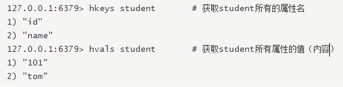
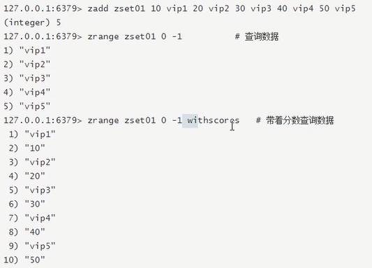
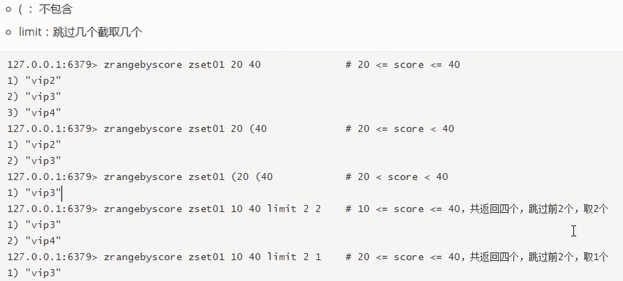

# redis

#### 1.redis的基本信息

1.默认有16个数据库  在redis.conf里

2.数据库键的数量

```
dbsize
8
keys *
```

#### 2.redis的安装

去redis的官网下载redis

```
tar zxf redis-6.0
make
vim redis.conf  #deamoned 改为yes  可以后台启动
src/redis-server redis.conf  #启动redis
```

#### 3.redis的基本操作


##### 1.键相关(key)

###### 1.模糊查询

```
keys k*

keys *k*

#匹配2个字符
keys k?? 
"kk3"
"k11"

[]通配括号内的某一个字符
记得其他字母,就第二个字母可能是a或e
keys r[ae]dis
"radis"
"redis"
```

###### 2.查看数据库里key的数量

```
dbsize
8
keys *
```

###### 3.查看key还有多久过期

```
ttl key     -1永不过期,-2已过期
```

###### 4.设置一个key带过期时间的

```
expire k1 10
```

5.查看key的数据类型

```
type k1
```


##### 2.关闭redis

```
redis-cli shutdown
redis-cli -p 6379 shutdown
```

##### 3.检查6379端口是否在监听

```
netstat -lntp | grep 6379
```

##### ######4.检查是否连接成功

```
redis-cli

ping
```

##### 5.切换库

```
select 15  #切换到16号数据库
```

##### 5.清空数据库

```
清空当前库
flushdb

清空所有(16个)库,慎用!!
flushall
```


###### 7.测试性能

redis-benchmark


###### 8.判断某一个键是否存在

```
exists k1
1
```


###### 9.挪库

```
move x1 8  #把x1移动到8号库
```


#### 4.五大基本数据类型详细操作

##### 1.String类型


###### 1.incr/decr/incrby加减操作


###### 2.getrange和setrange  替换


###### 3.设置存在的键


###### 4.getset命令

因为没有k6,所以get为null,然后将k6v6的值添加到数据库

获取值,显示的是旧值,然后再对值进行set


###### 5.mest/mget/..


##### 2.List类型

###### 1.lpush/rpush lrange


###### 2.lpop/rpop


###### 3.lindex


###### 4.Irem 删除

移除2个3


###### 5.Itrim


###### 6.rpoplpush


###### 7.lset 


###### 8.linsert(插入某元素之前之后)

头尾操作效率高,中介操作效率低


##### 3.Set集合类型

###### 1.sadd/smembers/sismember: 添加/查看/判断是否存在

注意:1和0不是下标,而是布尔. 1:true存在,2false不存在


###### 2.scard:获得集合中的元素个数


###### 3.srem:删除集合中的元素


###### 4.srandmember:从集合中随机获取几个元素


###### 5.spop:级出栈(移除)


###### 6.smove:移动元素:将key1某个值赋值给key2


###### 7.数学集合类


##### 4.Hash类型

###### 1.hset/hget/hmset/hmget/hgetall/hdel

添加/得到/多添加/多得到/得到全部/删除属性


###### 2.hlen

返回元素的属性个数


###### 3.hexists

判断元素是否存在某个属性


###### 4.hkeys/hvals

获得属性的所有key/获得属性的所有value



###### 5.hincrby/hincrbyfloat

自增(整数)/自增(小数)


###### 6.hsetnx

添加的时候,先判断是否存在


##### 5.Zset有序集合

###### 1.zadd/zrange(withscores)

添加/查询



###### 2.zrangebyscore

模糊查询




###### 3.zrem

删除元素


###### 4.zcard/zcount/zrank/zscore

集合长度/范围内元素个数/得元素下标/通过值得分数


##### 5.zrevrank

逆序找下标(从下向上)


###### 6.zrevrange

逆序查询


###### 7.zrevrangeyscore

逆序范围查找


#### 5.持久化

##### 1.RDB备份

Redis DataBase

在指定的时间间隔内,将内存中的数据集快照写入磁盘

默认保存在/usr/local/bin中,文件名dump.rdb(我这里保存在解压目录里)


###### 1.自动备份

1.默认的自动备份策略不利于测试,所以修改redis.conf文件中的自动备份策略

```
vim redis.conf
/SNAP #搜索
```


2.如果不需要自动备份,即停止数据持久化, 那么    save ""


###### 2.手动备份

```
save
```

###### 3.与RDB相关的配置


##### 2.AOF备份


###### AOF的相关配置


###### 如果两种备份共存,优先选择谁,优先选择AOF


#### 6.事务

##### 1.事务的基本特性


##### 2.redis事务执行

###### 1.开启事务,加入队列,一起执行,并成功


###### 2.回滚操作


##### 3.不满足原子性


##### 4.报错回滚


##### 5.watch监控


#### 7.发布订阅


#### 8.主从复制


##### 1.一主二仆


##### 2.复制原理


##### 3.哨兵模式

#三台服务器分别添加配置文件sentinel.conf,分别添加如下一条

```
sentinel monitor (被监控主机名) ip              端口   票数
sentinel monitor redis148     192.168.199.148 6379  1
sentinel monitor redis248    192.168.199.248 6379  1
sentinel monitor redis129    192.168.199.129 6379  1
```

启动服务器顺序:主redis-->从redis-->sentinel1/2/3

```
redis-sentinel sentinel.conf
```

挂掉1号老大

```
shutdown
```

查看最后的权利分配

​	3成为了新的老大,2还是小弟

如果之前的老大再次归来呢?

​	1号再次归来,自己成为了master.和3平起平坐

​	过了几秒之后,被哨兵检测到了1号机的归来,1号进入集体,作为小弟进入


缺点:

